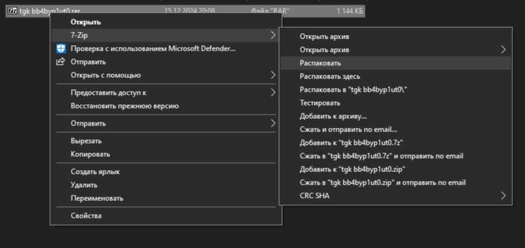
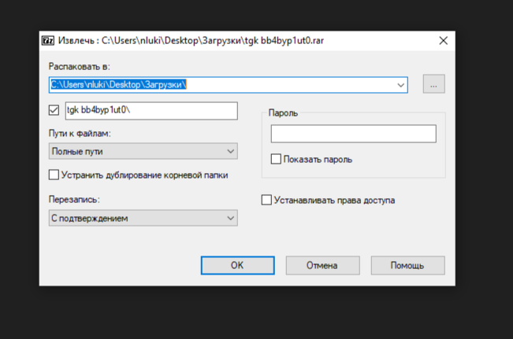
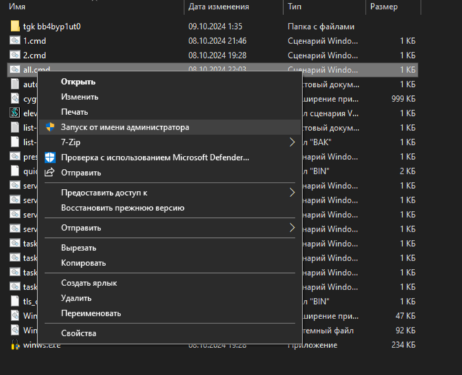
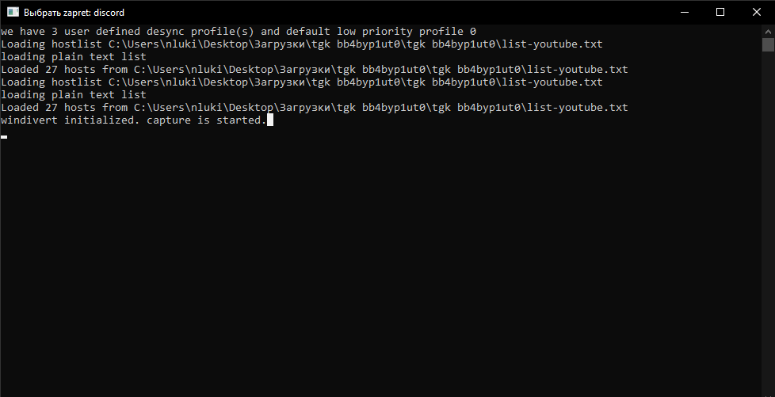

# DISCORD

Чтобы заработал DISCORD, скачайте архив "tgk bb4byp1ut0.rar".

Далее распакуйте его:

Находим файл "all.cmd" и открываем его от имени администратора:

После этого должно открытся следующее окно и Discord должен заработать:

